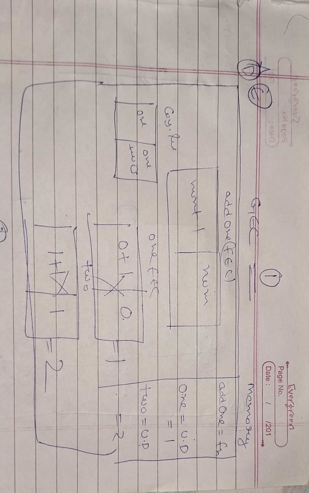
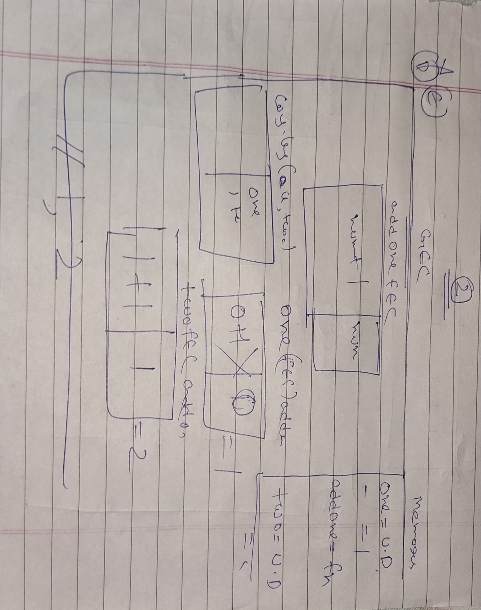
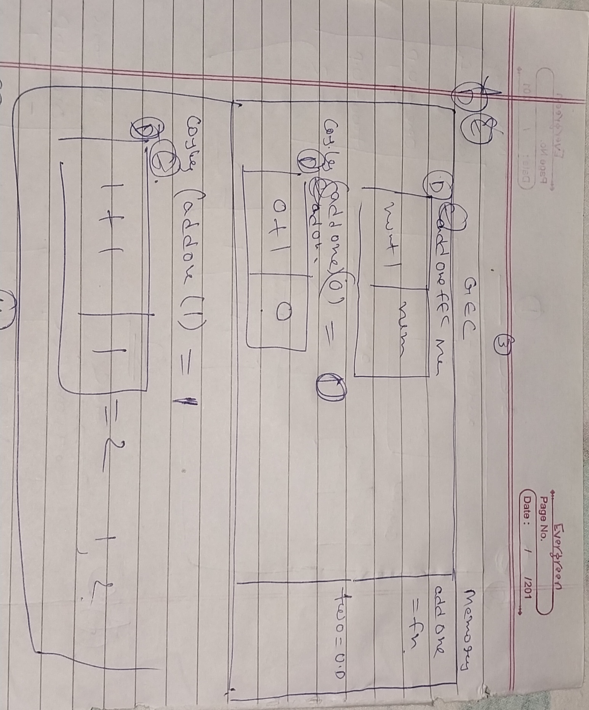
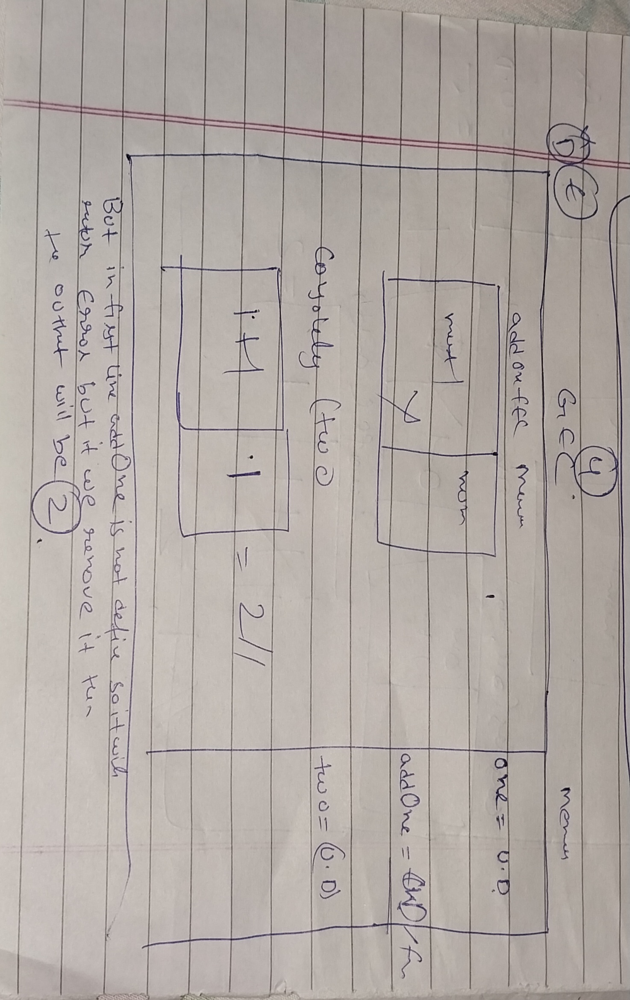
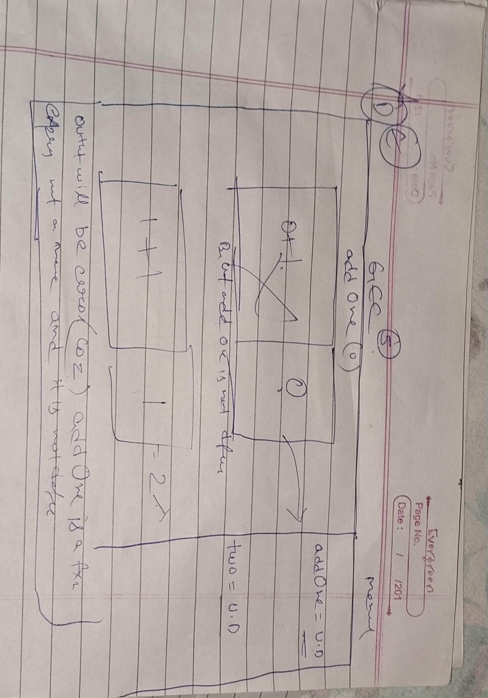

## Understanding Scope and the difference between var, let and const

Watch this video before doing the exercise: https://www.youtube.com/watch?v=XgSjoHgy3Rk

1. Guess the output:

```js
let firstName = 'Arya';
const lastName = 'Stark';
var knownAs = 'no one';

console.log(
  window.firstName,
  window.lastName,
  window.knownAs
);

// undefined undefined "no one"
```

2. Guess the output:

```js
let firstName = 'Arya';
const lastName = 'Stark';
var knownAs = 'no one';

function fullName(a, b) {
  return a + b;
}

console.log(window.fullName(firstName, lastName)); // AryaStark

```

3. Make a Execution Context Diagram for the following JS and write the output.

```js
function addOne(num){
  return num + 1;
}
var one = addOne(0);
var two = addOne(1);
console.log(one, two); // 1 2


```

4. Make a Execution Context Diagram for the following JS and write the output.

```js
var one = addOne(0);
function addOne(num){
  return num + 1;
}
var two = addOne(1);
console.log(one, two); // 1 2



```

5. Make a Execution Context Diagram for the following JS and write the output.

```js
console.log(addOne(0)); // 1
function addOne(num){
  return num + 1;
}
var two = addOne(1);
console.log(two); // 2



```

6. Make a Execution Context Diagram for the following JS and write the output.

```js

var one = addOne(0); // error - addOne is not defined
const addOne = (num) => {
  return num + 1;
};
var two = addOne(1);
console.log(two);



```

7. Make a Execution Context Diagram for the following JS and write the output.

```js
console.log(addOne(0)); // error - addOne is not defined
const addOne = (num) => {
  return num + 1;
};
var two = addOne(1);
console.log(two);



```


8. What will be the output of the following

```js
function isAwesome() {
  var awesome;
  if (false) {
    awesome = true;
  }
  console.log(awesome);
}
isAwesome();
```

9. What will be the output of the following

```js
function isAwesome() {
  let awesome;
  if (true) {
    awesome = true;
  }
  console.log(awesome);
}
isAwesome(); // true
```

10. What will be the output of the following

```js
function isAwesome() {
  let awesome;
  if (false) {
    awesome = true;
  }
  console.log(awesome);
}
isAwesome(); // undefined
```

11. What will be the output of the following

```js
let firstName = 'Arya';
const lastName = 'Stark';
var knownAs = 'no one';

function fullName(a, b) {
  return a + b;
}
const name = fullName(firstName, lastName);
console.log(name); // AryaStark
```

12. Guess the output of the code below with a reason.

```js
function sayHello() {
  let name = 'Arya Stark';
}
sayHello();

console.log(name);


// output  ReferenceError: name is not defined.

// Reason: name var is defined inside a fxn so we cant access its value outside

```

13. Guess the output of the code below with a reason.

```js
if (true) {
  var name = 'Arya Stark';
}
console.log(name);

// output  Arya Stark

// Reason: using var the variable is hoisted on top of fxn or the global scope so even var declared inside a
// fxn can be accessed

```

14. Guess the output of the code below with a reason.

```js
if (true) {
  let name = 'Arya Stark';
}
console.log(name);

// output : empty
// reason : unlike var let creates block scope so its value can't be accesed outside the block

```

15. Guess the output of the code below with a reason.

```js
for (var i = 0; i < 20; i++) {
  //
}
console.log(i);

// output : 20
// reason : var i declared using var keyword meaning fxn scope or global scope during execution loop runs 20 times
// incrementing value of i from 0 to 19 so loop completed i value will be 20.

```

16. Guess the output of the code below with a reason.

```js
for (let i = 0; i < 20; i++) {
  //
}
console.log(i);

// output : refernrce error i is not defined
// reason : var i declared using let which creates block scope accesible inside it only when console.log(i) was
// executed it is outside not in scope so cant be accessed leading to refernce error

```

17. Guess the output and the reason behind that.

```js

function sample() {
  if (true) {
    var username = 'John Snow';
  }
  console.log(username);
}
sample();

// output : John Snow
// reason: username defined with var creating block or global scope inside a fxn with if statement
// even cons.log(username) is outside scope but its value is accesible

```

18. Guess the output and the reason behind that.

```js
function sample() {
  if (true) {
    let username = 'John Snow';
  }
  console.log(username);
}
sample();

//output: ReferenceError: username is not defined.

//Reason: using let username is defined meaning block scope so when fxn sample is called the console.log(username)
// is outside the block so its value can't be accessed

```

19. Guess the output and the reason behind that.

```js
function sample() {
  var username = 'Arya Stark';
  if (true) {
    var username = 'John Snow';
    console.log(username);
  }
  console.log(username, 'second');
}
sample();
// output: John Snow
//         John Snow second

// reason: two declarations using var keyword

//The first var username = 'Arya Stark';

//The second var username = 'John Snow'; 

// The first console.log(username); statement is executed inside the if (true) block, printing 'John Snow' to the console.

//After that, the second console.log(username, 'second'); statement is executed outside the if block but still inside the function. At this point, the username variable has been reassigned the value 'John Snow' from within the if block, so it prints 'John Snow' followed by 'second'.

// As a result, the output is 'John Snow' and 'John Snow second'. 

```

20. Guess the output and the reason behind that.

```js
function sample() {
  let username = 'Arya Stark';
  if (true) {
    let username = 'John Snow';
    console.log(username, 'first');
  }
  console.log(username, 'second');
}
sample();
// output : John Snow first
//          John Snow second


// reason: two declarations using let keyword

//The first let username = 'Arya Stark';

//The second let username = 'John Snow'; 

// The first console.log(username); statement is executed inside the if (true) block, printing 'John Snow' to the console.

//After that, the second console.log(username, 'second'); statement is executed outside the if block but still inside the function. At this point, the username variable has been reassigned the value 'John Snow' from within the if block, so it prints 'John Snow' followed by 'second'.

// As a result, the output is 'John Snow' and 'John Snow second'. 
```

21. Guess the output and the reason behind that.

```js
function sample(...args) {
  for (let i = 0; i < args.length; i++) {
    let message = `Hello I am ${args[i]}`;
    console.log(message);
  }
}

sample('First', 'Second', 'Third');

// output : Hello I am First
//          Hello I am Second
//          Hello I am Third

// reason : The sample function takes a variable number of arguments using the rest parameter ...args. When you call the function with sample('First', 'Second', 'Third'), it passes three arguments 'First', 'Second', and 'Third' to the function.

//Inside the function, a for loop is used to iterate through each element of the args array. The let message = Hello I am ${args[i]}; statement creates a new message variable in each iteration of the loop, and it's set to a template literal containing the corresponding element from the args array.

//The loop will execute three times, once for each argument in the args array. For each iteration, the message variable will be assigned a new value, and the console.log(message); statement will print the message to the console.

```

22. Guess the output and the reason behind that.

```js
function sample(...args) {
  for (let i = 0; i < args.length; i++) {
    const message = `Hello I am ${args[i]}`;
    console.log(message);
  }
}

sample('First', 'Second', 'Third');

// output : Hello I am First
//          Hello I am Second
//          Hello I am Third

// reason :In this code, the sample function takes a variable number of arguments using the rest parameter ...args. When you call the function with sample('First', 'Second', 'Third'), it passes three arguments 'First', 'Second', and 'Third' to the function.

//Inside the function, a for loop is used to iterate through each element of the args array. The const message = Hello I am ${args[i]}; statement creates a new constant variable message in each iteration of the loop, and it's set to a template literal containing the corresponding element from the args array.

// Since message is declared using const, it is block-scoped, just like a variable declared with let. However, being a constant, its value cannot be changed after initialization.

// The loop will execute three times, once for each argument in the args array. For each iteration, the message constant will be assigned a new value, and the console.log(message); statement will print the message to the console.
```

23. Guess the output and the reason behind that.

```js
if (true) {
  const myFunc = function () {
    console.log(username, 'Second');
  };
  console.log(username, 'First');
  let username = 'Hello World!';
  myFunc();
}

// output: ReferenceError: Cannot access 'username' before initialization

// reason :  const myFunc = function () { ... } declaration and creates the function myFunc within the block     scope.However, the function is not yet executed at this point.

// It then encounters the first console.log(username, 'First'); statement. However, the username variable is declared with let but not yet initialized. When trying to access the username variable before its initialization, it results in a ReferenceError.

// Next, it encounters the let username = 'Hello World!'; statement and creates the username variable within the block scope. The variable is now accessible within the block.

//Finally, when myFunc() is called, the function tries to log the username variable, but since the function was defined within the same block, it has access to the username variable, and it correctly logs 'Hello World!' as 'Second'.

// However, before the myFunc() call, the first console.log(username, 'First'); statement has already thrown a ReferenceError because of trying to access the username variable before its initialization.

// As a result, the code throws a ReferenceError when trying to access the username variable before it is initialized. The subsequent myFunc() call works fine and logs 'Hello World!' with 'Second'.

```

24. Guess the output and the reason behind that.

```js
function outer() {
  let movie = 'Mad Max: Fury Road';
  function inner() {
    console.log(
      `I love this movie called ${movie.toUpperCase()}`
    );
  }
  inner();
}

outer();

// output : I love this movie called MAD MAX: FURY ROAD
// reason : Since the inner() function is defined inside outer(), it has access to the variables declared in its parent scope, which includes the movie variable. Therefore, the inner() function can access and use the movie variable, and the value of 'Mad Max: Fury Road' is logged in uppercase.

```

25. Guess the output and the reason behind that.

```js
function outer() {
  let movie = 'Mad Max: Fury Road';
  function inner() {
    let movie = 'Before Sunrise';
    console.log(
      `I love this movie called ${movie.toUpperCase()}`
    );
  }
  inner();
}

outer();

// output : I love this movie called BEFORE SUNRISE

// reason : Since the inner() function has its own movie variable, it prefers to use the local variable instead of the one from the outer scope. As a result, the value of 'Before Sunrise' is logged in uppercase. The outer movie variable with the value 'Mad Max: Fury Road' is not affected by the inner scope and remains unchanged.
```

26. Guess the output and the reason behind that.

```js
function outer() {
  let movie = 'Mad Max: Fury Road';
  function inner() {
    let movie = 'Before Sunrise';
    function extraInner() {
      let movie = 'Gone Girl';
      console.log(
        `I love this movie called ${movie.toUpperCase()}`
      );
    }
    extraInner();
  }
  inner();
}
outer();

// output : I love this movie called GONE GIRL
// reason : Since each function has its own movie variable, they prefer to use their respective local variables instead of the ones from the outer scopes. As a result, the value of 'Gone Girl' is logged in uppercase. The outer movie variable with the value 'Mad Max: Fury Road' is not affected by the inner scopes and remains unchanged. The same applies to the movie variable declared in the inner() function with the value 'Before Sunrise'.

```

30. Using reduce find the final value when the initial value passed is `100`. You have to pass the output of one function into the input of next function in the array `allFunctions` starts with `addOne` ends with `half`.

```js
const addOne = (num) => {
  return num + 1;
};
const subTwo = (num) => {
  return num - 2;
};
const multiplyThree = (num) => {
  return num * 3;
};
const half = (num) => {
  return num / 2;
};

let allFunctions = [
  addOne,
  subTwo,
  multiplyThree,
  addOne,
  multiplyThree,
  half,
];

const initialValue = 100;

const finalValue = allFunctions.reduce((accumulator, func) => {
  return func(accumulator);
}, initialValue);

console.log(finalValue);

// Answer is: 447
```
